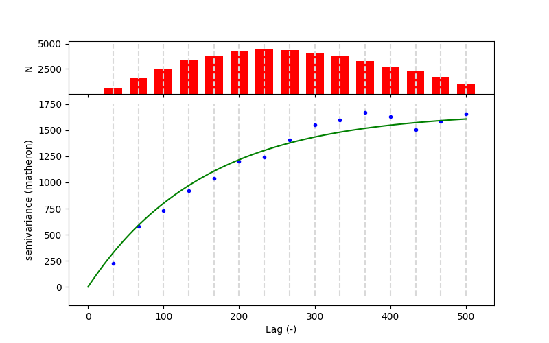

SciKit-GStat
============

Info: scikit-gstat needs Python >= 3.6!

.. image:: https://img.shields.io/pypi/v/scikit-gstat?color=green&logo=pypi&logoColor=yellow&style=flat-square   :alt: PyPI
    :target: https://pypi.org/project/scikit-gstat

.. image:: https://img.shields.io/github/v/release/mmaelicke/scikit-gstat?color=green&logo=github&style=flat-square   :alt: GitHub release (latest by date)
    :target: https://github.com/mmaelicke/scikit-gstat

.. image:: https://github.com/mmaelicke/scikit-gstat/workflows/Test%20and%20build%20docs/badge.svg
    :target: https://github.com/mmaelicke/scikit-gstat/actions

.. image:: https://api.codacy.com/project/badge/Grade/34022fb8b795435b8eeb5431159fa7c6
   :alt: Codacy Badge
   :target: https://app.codacy.com/app/mmaelicke/scikit-gstat?utm_source=github.com&utm_medium=referral&utm_content=mmaelicke/scikit-gstat&utm_campaign=Badge_Grade_Dashboard

.. image:: https://codecov.io/gh/mmaelicke/scikit-gstat/branch/master/graph/badge.svg
    :target: https://codecov.io/gh/mmaelicke/scikit-gstat
    :alt: Codecov

.. image:: https://zenodo.org/badge/98853365.svg
   :target: https://zenodo.org/badge/latestdoi/98853365

How to cite
-----------

In case you use SciKit-GStat in other software or scientific publications,
please reference this module. It is published and has a DOI. It can be cited
as:

  Mirko Mälicke, Egil Möller, Helge David Schneider, & Sebastian Müller. (2021, May 28). 
    mmaelicke/scikit-gstat: A scipy flavoured geostatistical variogram analysis toolbox 
    (Version v0.6.0). Zenodo. http://doi.org/10.5281/zenodo.4835779

Full Documentation
------------------

The full documentation can be found at: https://mmaelicke.github.io/scikit-gstat

Description
-----------

SciKit-Gstat is a scipy-styled analysis module for geostatistics. It includes
two base classes ``Variogram`` and ``OrdinaryKriging``. Additionally, various
variogram classes inheriting from ``Variogram`` are available for solving
directional or space-time related tasks.
The module makes use of a rich selection of semi-variance
estimators and variogram model functions, while being extensible at the same
time.
The estimators include:

- matheron
- cressie
- dowd
- genton
- entropy
- two experimental ones: quantiles, minmax

The models include:

- sperical
- exponential
- gaussian
- cubic
- stable
- matérn

with all of them in a nugget and no-nugget variation. All the estimator are
implemented using numba's jit decorator. The usage of numba might be subject
to change in future versions.

Installation
~~~~~~~~~~~~

PyPI
^^^^
.. code-block:: bash

  pip install scikit-gstat

**Note:** It can happen that the installation of numba or numpy is failing using pip. Especially on Windows systems. 
Usually, a missing Dll (see eg. `#31 <https://github.com/mmaelicke/scikit-gstat/issues/31>`_) or visual c++ redistributable is the reason. 

GIT:
^^^^

.. code-block:: bash

  git clone https://github.com/mmaelicke/scikit-gstat.git
  cd scikit-gstat
  pip install -r requirements.txt
  pip install -e .

Conda-Forge:
^^^^^^^^^^^^

From Version `0.5.5` on `scikit-gstat` is also available on conda-forge.
Note that for versions `< 1.0` conda-forge will not always be up to date, but
from `1.0` on, each minor release will be available.

.. code-block:: bash

  conda install -c conda-forge scikit-gstat

Quickstart
----------

The `Variogram` class needs at least a list of coordiantes and values.
All other attributes are set by default.
You can easily set up an example by using the `skgstat.data` sub-module,
that includes a growing list of sample data.

.. code-block:: python

  import skgstat as skg

  # the data functions return a dict of 'sample' and 'description'
  coordinates, values = skg.data.pancake(N=300).get('sample')

  V = skg.Variogram(coordinates=coordinates, values=values)
  print(V)

.. code-block:: bash

  spherical Variogram
  -------------------
  Estimator:         matheron
  Effective Range:   353.64
  Sill:              1512.24
  Nugget:            0.00

All variogram parameters can be changed in place and the class will automatically
invalidate and update dependent results and parameters.

.. code-block:: python

  V.model = 'exponential'
  V.n_lags = 15
  V.maxlag = 500

  # plot - matplotlib and plotly are available backends
  fig = V.plot()

